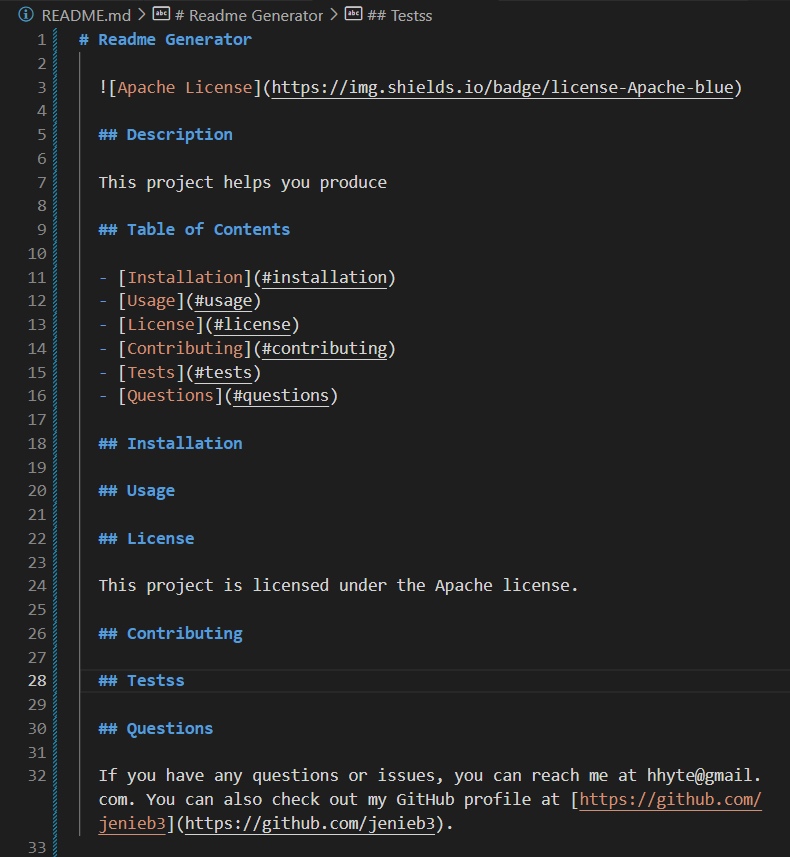
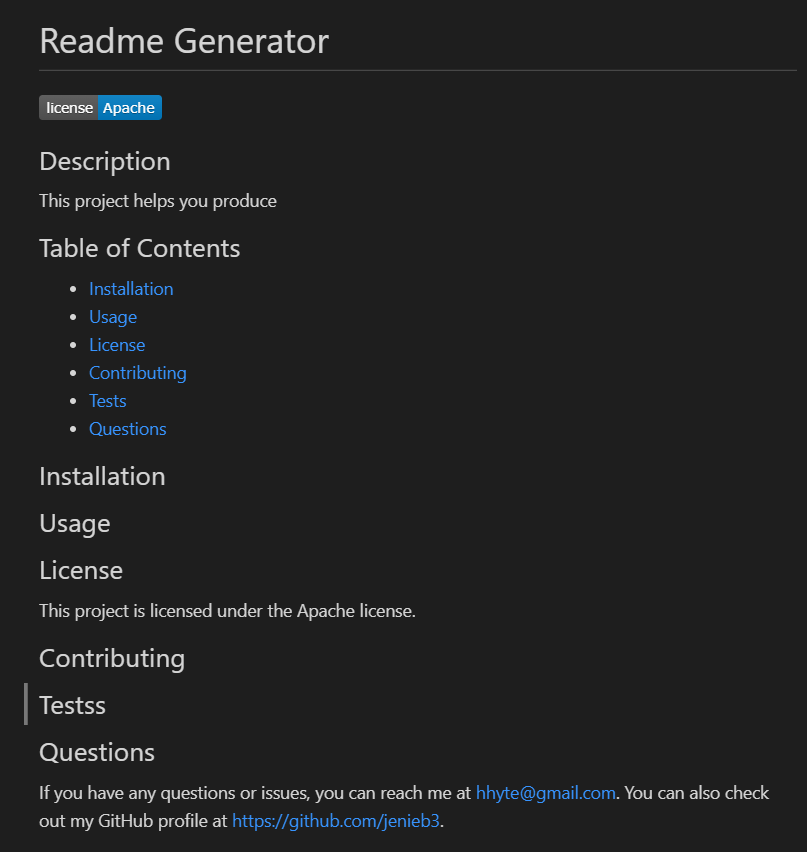
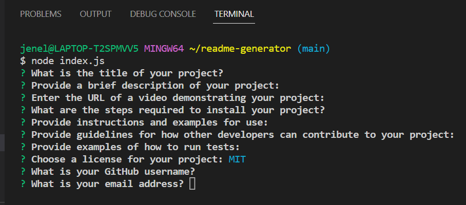

# Professional README.md Generator

  
  
  ## Description

  This project uses npm inquirer package to dynamically create a professional Readme.md file. However, before the Readme is generated a user is propmted to input the required information for the different sections of the Readme file. I ran this application a few times in my terminal and it generated a Readme.md file. I also added a blank Readme file which I had pulled from github and this application was able to generate the content of this Readme.
  
  ## Table of Contents

  - [Installation](#installation)
  - [Usage](#usage)
  - [License](#license)
  - [Contributing](#contributing)
  - [Tests](#tests)
  - [Questions](#questions)  

  ## Installation

  First node.js needs to be installed first. Next npm had to be installed by running the command npm init. This project came with some starter code but the package.json had to be changed to version 6:5:0.

  ## Usage

  This Readme generator will save time, it will also add visibility and credibility to your projects as the file is more understandable and accessible to other developers. In addition, it prompts the user to provide information to the relevant sections of the Readme so the relevant sections are not overlooked or forgotten. If you would like to add anything after the Readme was generated you can and it will not affect that professional finish.

  ## License

  This project is licensed under the MIT license.

  ## Contributing

  To contribute to my project, please fork the repository, make your changes on a separate branch, and submit a pull request. I'll review your changes as soon as possible!

  ## Tests
  To run the tests for my project, simply run the npm test command. This will launch the test runner and display the results in your terminal.

  ## Questions
  For questions or support, please contact jenelle.garbrah3@gmail.com. To see other projects, visit https://github.com/jenieb3/.

  ## Screenshot
 
 
 

  ## Video
  [Professional README.md Generator Video Demo](https://drive.google.com/file/d/1NRY9zzZFbMaEG5gqYOIXEe063ltxAk-a/view?usp=share_link)
